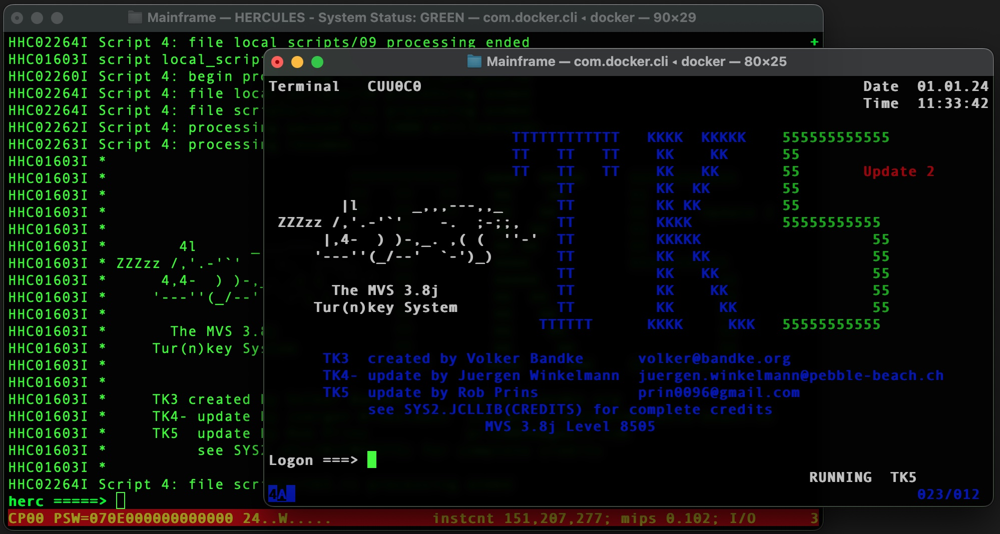

## MVS TurnKey installations

The Docker Containers in this repo contain MVS installations, created and build by 
briliant gentlemen in the mainframe world. Without these MVS TurnKey installations, 
most of us would never get the pleasure of using MVS. 
All credit for the MVS TurnKey installations goes to these briliant MVS experts.

	Thank you for all your work and contributions.

For a list of the Turnkey installations and links, please go the reference sections
at the end of this page.


## This Repo - MVS and c3270 emulator in one container

The containers in this repo, contain the MVS TurnKey installations, plus 
additional software including the latest release of Hercules/Hyperion and c3270,
making it possible to connect using 3270 to the MVS TurnKey installations without
requirering anything but Docker. 

## The benefit of these containers 

Using this repo, you can start all MVS TurnKey installations using one command.
Access the MVS console or login to MVS, using the Docker and c3270.

## Requirements

Docker and Docker compose must be installed

##_Quick start procedure_
Start all MVS TurnKey installations using one command

```sh
docker compose up -d
```
This will start one container for each of the MVS TurnKey installations in this
repo, which includes VM370, TK4, TK5, TK5upd2, MVS/CE
 
Access the MVS Console, e.g. for TK4,  using:

```sh
docker attach tk4
```

Connect to MVS in the container using the included c3270 emulator

```sh
docker exec -it tk4 ./tn3270
```

##_Detailed procedures for starting and using the containers_

To start a single container, instead of all containers, e.g. for  MVS/CE

```sh
docker run -it --name myMVS -p 3270:3270/tcp mhardingdk/mvs
```
MVS/CE is currently tagged as latest
 
If you want a different TurnKey installation, use the tags. E.g. for TK4 use

```sh
docker run -it --name myMVS -p 3270:3270/tcp mhardingdk/mvs:tk4
```

Example of starting all MVS TurnKey installations using one command


Example of running a single MVS Container and c3270 emulator, started as described above


## References

For usernames and passwords please refer to the specific TurnKey installation
documentation that is linked below.

The following software is used in the containers in this repo.
- [Hercules](https://hercules-390.github.io/html/) - Hercules System/370, ESA/390, and z/Architecture Emulator
- [MVS/CE](https://hub.docker.com/r/mainframed767/mvsce) - MVS/CE Docker image
- [MVS Turn Key 5](https://www.prince-webdesign.nl/index.php/software/mvs-3-8j-turnkey-5) - by Rob Prins
- [MVS Turn Key 4](https://wotho.pebble-beach.ch/tk4-) - by Juergen Winkelmann
- [c3270](https://x3270.miraheze.org/wiki/C3270) - 3270 emulator for Linux

