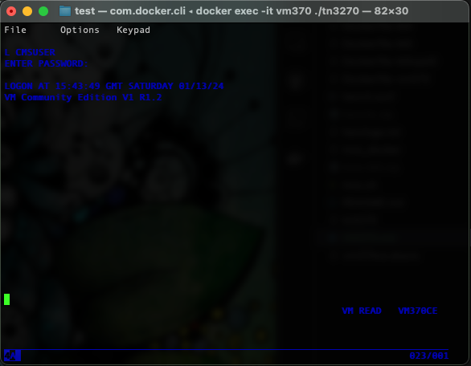

# How to VM/370 DOS/VS and c3270 

Some help for mainframe newbies, like myself.

## VM/370 How to logon

* Start VM370, or all MVS TurnKey installations as described in [Start all MVS TurnKey installations](./README.md#start-all-mvs-turnkey-installations)

* Open c3270 and connect to VM370 
`docker exec -it vm370 ./tn3270`

This will give you the following screen

* Clear the screen
`Ctrl + c`

* Login by typing
`L CMSUSER`

* Enter Password and press enter
`CMSUSER`

* press enter

* Clear the screen `Ctrl + c`
* Type `help`

### IPL CMS in VM/370

After logon, you can IPL the system by typing one of the following IPL strings and pressing Enter.

* `IPL CMS`
* `LOGON MAINT CPCMS` 
* When system goes to "VM READ" botton right hit ENTER

## c3270 basic commands

* Clear the screen press
`Ctrl + c`

* Drop down menu
`Ctrl + n`

